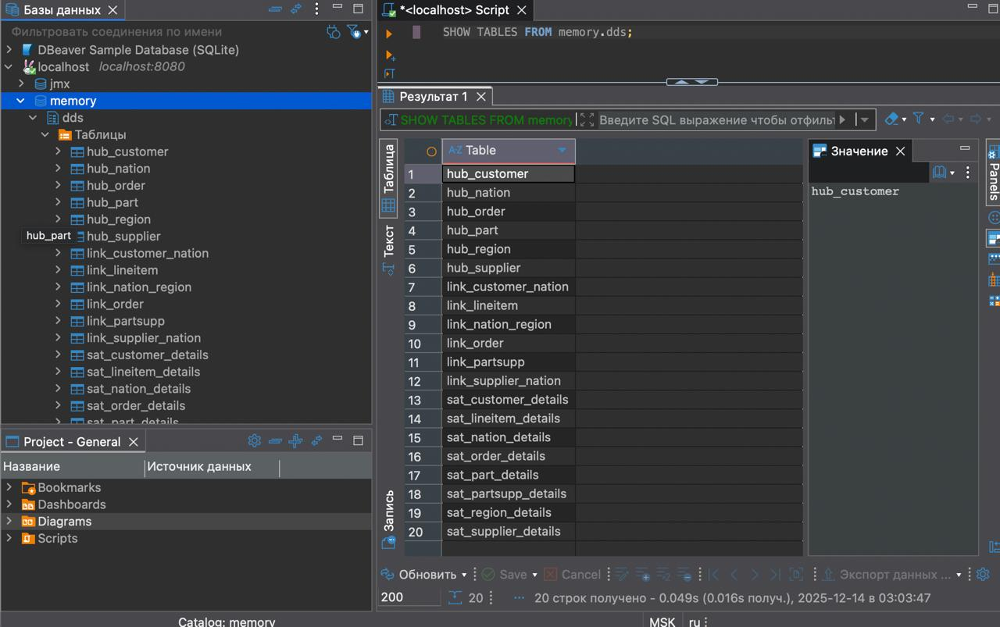
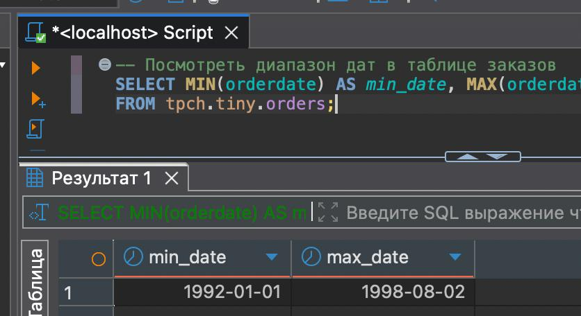
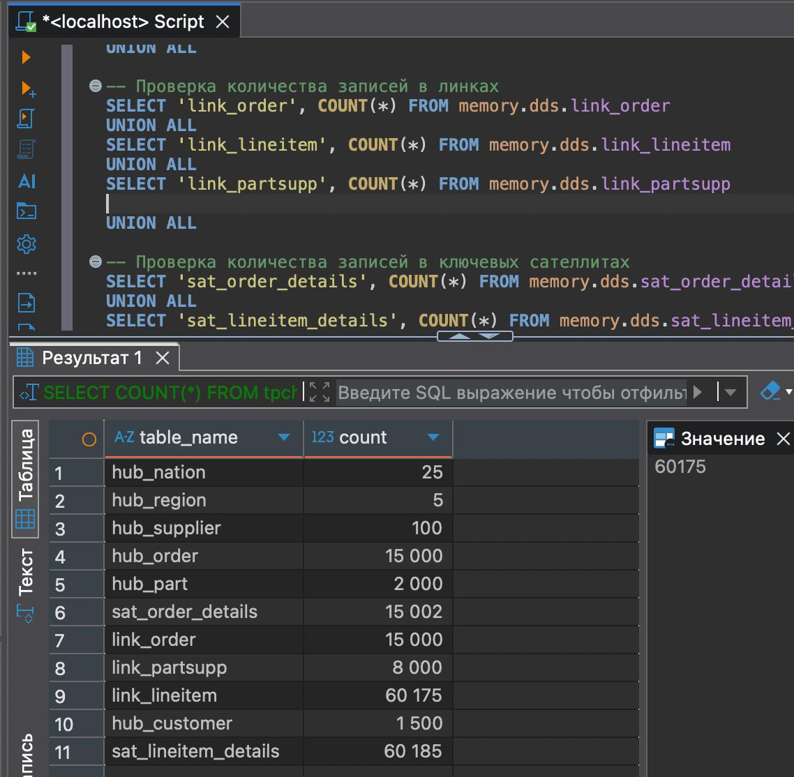

# Итоговое задание по модулю 6

## Проектирование модели данных Data Vault для TPC-H
TPC-H benchmark состоит из 8 взаимосвязанных таблиц, представляющих систему поставок
* `Customer` - информация о клиентах
* `Orders` - информация о заказах
* `LineItem` - детали заказов (строки заказов)
* `Part` - информация о деталях/товарах
* `Supplier` - информация о поставщиках
* `PartSupp` - информация о поставках деталей
* `Nation` - информация о странах
* `Region` - информация о регионах
### Просмотр структуры схемы tiny в Trino
```sql
SHOW TABLES FROM tpch.tiny;
```
### Модель Data Vault
 
### Описание сущностей Data Vault
1. ХАБЫ (Hubs) - бизнес-сущности:
* HUB_CUSTOMER
  - Бизнес-ключ: C_CUSTKEY (уникальный идентификатор клиента)
  - Описание: Клиент в системе
* HUB_ORDER
  - Бизнес-ключ: O_ORDERKEY (уникальный идентификатор заказа)
  - Описание: Заказ клиента
* HUB_PART
  - Бизнес-ключ: P_PARTKEY (уникальный идентификатор товара/детали)
  - Описание: Товар/деталь в каталоге
* HUB_SUPPLIER
  - Бизнес-ключ: S_SUPPKEY (уникальный идентификатор поставщика)
  - Описание: Поставщик товаров
* HUB_NATION
  - Бизнес-ключ: N_NATIONKEY (уникальный идентификатор страны)
  - Описание: Страна
* HUB_REGION
  - Бизнес-ключ: R_REGIONKEY (уникальный идентификатор региона)
  - Описание: Регион
2. ЛИНКИ (Links) - связи между сущностями:
* LINK_ORDER
  - Связывает: HUB_ORDER + HUB_CUSTOMER
  - Описание: Связь заказа с клиентом
* LINK_LINEITEM
  - Связывает: HUB_ORDER + HUB_PART + HUB_SUPPLIER
  - Описание: Строка заказа с товаром и поставщиком
  - Включает атрибут line_number (номер строки в заказе)
* LINK_PARTSUPP
  - Связывает: HUB_PART + HUB_SUPPLIER
  - Описание: Поставка товара от поставщика
* LINK_CUSTOMER_NATION
  - Связывает: HUB_CUSTOMER + HUB_NATION
  - Описание: Принадлежность клиента к стране
* LINK_SUPPLIER_NATION
  - Связывает: HUB_SUPPLIER + HUB_NATION
  - Описание: Принадлежность поставщика к стране
* LINK_NATION_REGION
  - Связывает: HUB_NATION + HUB_REGION
  - Описание: Принадлежность страны к региону
3. СПУТНИКИ (Satellites) - описательные атрибуты:
* SAT_CUSTOMER_DETAILS (для HUB_CUSTOMER)
  - Атрибуты: C_NAME, C_ADDRESS, C_PHONE, C_ACCTBAL, C_MKTSEGMENT, C_COMMENT
  - Частота изменений: Низкая
* SAT_ORDER_DETAILS (для HUB_ORDER)
  - Атрибуты: O_ORDERSTATUS, O_TOTALPRICE, O_ORDERDATE, O_ORDERPRIORITY, O_CLERK, O_SHIPPRIORITY, O_COMMENT
  - Частота изменений: Низкая (заказы обычно не меняются после создания)
* SAT_LINEITEM_DETAILS (для LINK_LINEITEM)
  - Атрибуты: L_QUANTITY, L_EXTENDEDPRICE, L_DISCOUNT, L_TAX, L_RETURNFLAG, L_LINESTATUS, L_SHIPDATE, L_COMMITDATE, L_RECEIPTDATE, L_SHIPINSTRUCT, L_SHIPMODE, L_COMMENT
  - Частота изменений: Средняя (статусы доставки могут изменяться)
* SAT_PART_DETAILS (для HUB_PART)
  - Атрибуты: P_NAME, P_MFGR, P_BRAND, P_TYPE, P_SIZE, P_CONTAINER, P_RETAILPRICE, P_COMMENT
  - Частота изменений: Низкая
* SAT_SUPPLIER_DETAILS (для HUB_SUPPLIER)
  - Атрибуты: S_NAME, S_ADDRESS, S_PHONE, S_ACCTBAL, S_COMMENT
  - Частота изменений: Низкая
* SAT_PARTSUPP_DETAILS (для LINK_PARTSUPP)
  - Атрибуты: PS_AVAILQTY, PS_SUPPLYCOST, PS_COMMENT
  - Частота изменений: Средняя
* SAT_NATION_DETAILS (для HUB_NATION)
  - Атрибуты: N_NAME, N_COMMENT
  - Частота изменений: Очень низкая
* SAT_REGION_DETAILS (для HUB_REGION)
  - Атрибуты: R_NAME, R_COMMENT
  - Частота изменений: Очень низкая
## Запуск
1. Запуск Trino в Docker:
`docker run --name trino -d -p 8080:8080 trinodb/trino`
2. Подключение через DBeaver с параметрами:
* Хост: `localhost`
* Порт: `8080`
* Пользователь: `guest`
* Драйвер: `Trino`
3. Выполнение скриптов:
* Создание схемы и таблицы (`create_dds_tiny.sql` из папки `part2`)

Проверка создания
```sql
SHOW TABLES FROM memory.dds;
```
 

* Загрузка данных (`insert_dds_tiny.sql` из папки `part3`)

Проверка на примере хабов
```sql
SELECT COUNT(*) AS cnt FROM memory.dds.hub_customer;     
SELECT COUNT(*) AS cnt FROM memory.dds.hub_order;        
SELECT COUNT(*) AS cnt FROM memory.dds.hub_part;         
SELECT COUNT(*) AS cnt FROM memory.dds.hub_supplier;    
SELECT COUNT(*) AS cnt FROM memory.dds.hub_nation;       
SELECT COUNT(*) AS cnt FROM memory.dds.hub_region;
```
* Инкрементальная загрузка (`insert_date_dds_tiny.sql` из папки `part4`)
  
Вычисление диапазона дат 
 

Проверка загрузки инкрементальной загрузки
 ```sql
 -- Сколько заказов за 1996-01-02?
SELECT COUNT(*) FROM tpch.tiny.orders WHERE orderdate = DATE '1996-01-02'; -- 2

-- Сколько добавилось в sat_order_details?
SELECT COUNT(*) FROM memory.dds.sat_order_details WHERE order_date = DATE '1996-01-02';

```
4. Проверка результатов
```sql
-- =============================================
-- ФИНАЛЬНАЯ ПРОВЕРКА: количество записей в DDS
-- =============================================

-- Проверка количества записей в хабах
SELECT 'hub_customer' AS table_name, COUNT(*) AS count FROM memory.dds.hub_customer
UNION ALL
SELECT 'hub_order', COUNT(*) FROM memory.dds.hub_order
UNION ALL
SELECT 'hub_part', COUNT(*) FROM memory.dds.hub_part
UNION ALL
SELECT 'hub_supplier', COUNT(*) FROM memory.dds.hub_supplier
UNION ALL
SELECT 'hub_nation', COUNT(*) FROM memory.dds.hub_nation
UNION ALL
SELECT 'hub_region', COUNT(*) FROM memory.dds.hub_region

UNION ALL

-- Проверка количества записей в линках
SELECT 'link_order', COUNT(*) FROM memory.dds.link_order
UNION ALL
SELECT 'link_lineitem', COUNT(*) FROM memory.dds.link_lineitem
UNION ALL
SELECT 'link_partsupp', COUNT(*) FROM memory.dds.link_partsupp

UNION ALL

-- Проверка количества записей в ключевых сателлитах
SELECT 'sat_order_details', COUNT(*) FROM memory.dds.sat_order_details
UNION ALL
SELECT 'sat_lineitem_details', COUNT(*) FROM memory.dds.sat_lineitem_details;
```
* `sat_order_details`
15000 + 2 инкремента
* `sat_lineitem_details`
60175 + 10 инкрементов

 

5. Удаление контейнера и образа
```bash
docker stop trino
docker rm trino
docker rmi trinodb/trino
```
  
