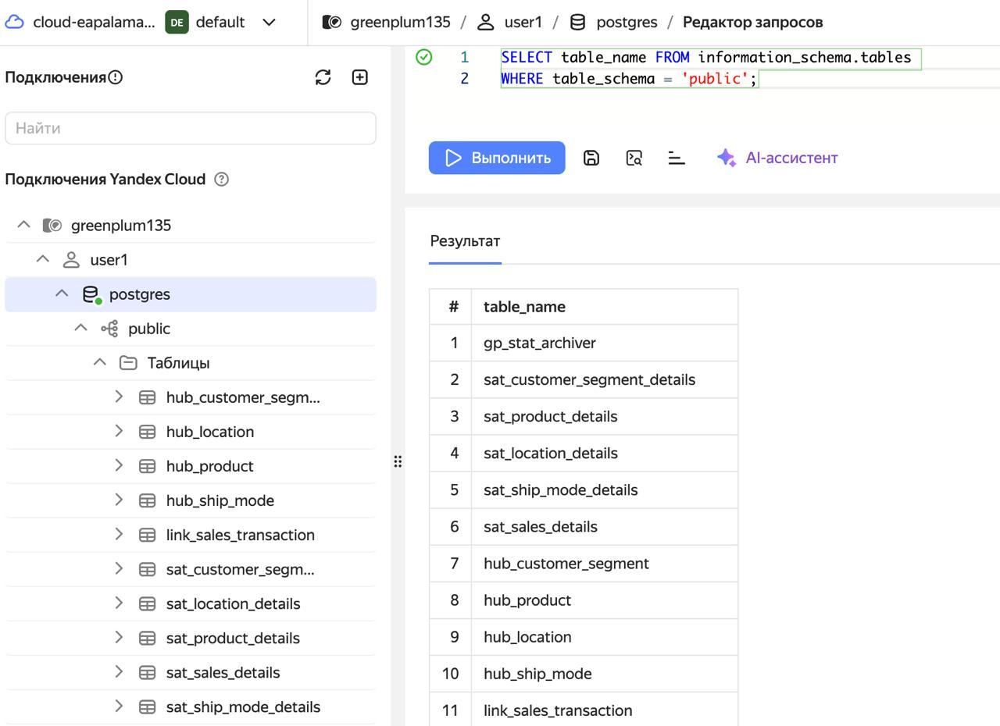
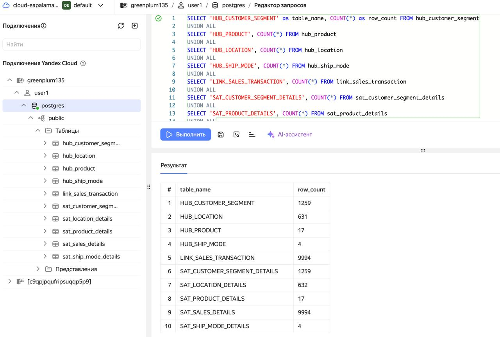

# Итоговое задание по модулю 5

Исходный файл `SampleSuperstore.csv`

## Часть 1. Проектирование хранилища данных

### Аналитический разбор

1. Временные метки
* Т.к. отсутствуют даты транзакций, используем `Load_DTS` как общую дату загрузки для всех записей
* Ограничение: Временной анализ продаж невозможен

2. Идентификация клиентов
* Т.к. отсутсвуют уникальные идентификаторы клиентов, используем сегменты клиентов в локациях
* Ограничение: Анализ индивидуального поведения клиентов невозможен

3. Идентификация заказов
* Т.к. отсутсвует `Order ID`, будем считать, что каждая строка в CSV = отдельная транзакция
* Ограничение: Группировка товаров в рамках одного заказа невозможна

### Описание сущностей
**ХАБЫ (Hubs)**
1. HUB_CUSTOMER_SEGMENT
* Бизнес-ключ: `Segment` + `City` + `State` + `Postal_Code`
* Название: Сегмент клиентов в локации
* Пример бизнес-ключа: `Consumer_Henderson_Kentucky_42420`

2. HUB_PRODUCT
* Бизнес-ключ: `Sub_Category` + `Category`
* Название: Продукт в товарной иерархии
* Обоснование: Идентифицирует товарную позицию в рамках категорий
* Пример бизнес-ключа: `Bookcases_Furniture`

3. HUB_LOCATION
* Бизнес-ключ: `Postal_Code`
* Название: Географическая локация
* Обоснование: Почтовый индекс уникально идентифицирует локацию в рамках данных
* Пример бизнес-ключа: `42420`

4. HUB_SHIP_MODE
* Бизнес-ключ: `Ship_Mode`
* Название: Способ доставки
* Обоснование: Разные способы доставки влияют на ее стоимость и время
* Пример бизнес-ключа: `Second_Class`

**ССЫЛКИ (Links)**

5. LINK_SALES_TRANSACTION
* Назначение: Связывает все сущности для факта продажи
* Связывает: `Customer_Segment` + `Product` + `Location` + `Ship_Mode`
* Обоснование: Каждая строка в CSV представляет отдельную транзакцию продажи
* Состав ключей: `HK_Customer_Segment_ID` + `HK_Product_ID` + `HK_Location_ID` + `HK_Ship_Mode_ID`

**СПУТНИКИ (Satellites)**

6. SAT_CUSTOMER_SEGMENT_DETAILS
* Родитель: `HUB_CUSTOMER_SEGMENT`
* Атрибуты: `Segment`, `City`, `State`, `Postal_Code`, `Region`, `Country`
* Обоснование: Описательные атрибуты сегмента клиентов в локации
* Частота изменений: Низкая (география и сегменты стабильны)

7. SAT_PRODUCT_DETAILS
* Родитель: `HUB_PRODUCT`
* Атрибуты: `Category`, `Sub_Category`
* Обоснование: Иерархия товарной классификации
* Частота изменений: Очень низкая (категории редко меняются)

8. SAT_LOCATION_DETAILS
* Родитель: HUB_LOCATION
* Атрибуты: `City`, `State`, `Region`, `Country`
* Обоснование: Географические описательные атрибуты
* Частота изменений: Очень низкая (география стабильна)

9. SAT_SHIP_MODE_DETAILS
* Родитель: `HUB_SHIP_MODE`
* Атрибуты: `Ship_Mode`
* Обоснование: Описание способа доставки
* Частота изменений: Очень низкая (способы доставки фиксированы)

10. SAT_SALES_DETAILS
* Родитель: `LINK_SALES_TRANSACTION`
* Атрибуты: `Sales`, `Quantity`, `Discount`, `Profit`
* Обоснование: Ключевые метрики продаж (изменяемые показатели)
* Частота изменений: Высокая (каждая транзакция уникальна)

### Можем анализировать
* Продажи по сегментам клиентов
* Эффективность товарных категорий
* Географическое распределение продаж
* Влияние способов доставки на прибыль
* Метрики: средний чек, скидки, прибыльность

Диаграмма представлена в файле `superstore_dv_diagram.mermaid` в папке `part1`.

 

## Часть 2. Подготовка к реализации
* Скрипт по созданию таблиц `ddl_create_dv.sql` в папке `part2`.
* Скрипт по загрузке данных в Data Vault `etl_fill_data.sql` в папке `part2`.
## Часть 3. Реализация в WebSQL 
1. Выполняем скрипт `ddl_create_dv.sql`

Как результат, было создано 10 таблиц в соответствии с плановой структурой хранилища. `gp_stat_archiver` - системная таблица Greenplum. 
 

2. Выполняем скрипт `etl_fill_data.sql`

Как результат, хранилище заполнилось.

3. Выполняем скрипт для проверки количества строк в каждой таблице
```
SELECT 'HUB_CUSTOMER_SEGMENT' as table_name, COUNT(*) as row_count FROM hub_customer_segment
UNION ALL
SELECT 'HUB_PRODUCT', COUNT(*) FROM hub_product  
UNION ALL
SELECT 'HUB_LOCATION', COUNT(*) FROM hub_location
UNION ALL
SELECT 'HUB_SHIP_MODE', COUNT(*) FROM hub_ship_mode
UNION ALL
SELECT 'LINK_SALES_TRANSACTION', COUNT(*) FROM link_sales_transaction
UNION ALL
SELECT 'SAT_CUSTOMER_SEGMENT_DETAILS', COUNT(*) FROM sat_customer_segment_details
UNION ALL
SELECT 'SAT_PRODUCT_DETAILS', COUNT(*) FROM sat_product_details
UNION ALL
SELECT 'SAT_LOCATION_DETAILS', COUNT(*) FROM sat_location_details
UNION ALL
SELECT 'SAT_SHIP_MODE_DETAILS', COUNT(*) FROM sat_ship_mode_details
UNION ALL
SELECT 'SAT_SALES_DETAILS', COUNT(*) FROM sat_sales_details
ORDER BY table_name;
```
 

Результат представлен в файле `res1.csv` в папке `part3`.

4. Выполняем скрипт для проверки 5 записей из каждой таблицы
```
-- хабы
SELECT * FROM hub_customer_segment LIMIT 5;
SELECT * FROM hub_product LIMIT 5;
SELECT * FROM hub_location LIMIT 5;
SELECT * FROM hub_ship_mode LIMIT 5;

-- линк
SELECT * FROM link_sales_transaction LIMIT 5;

-- спутники
SELECT * FROM sat_sales_details LIMIT 5;
```
Результат представлен в файле `res2.csv` в папке `part3`.

5. Выполним скрипт для получения структуры итоговой базы
```
SELECT table_name, column_name, data_type, is_nullable
FROM information_schema.columns 
WHERE table_schema = 'public'
ORDER BY table_name, ordinal_position;
```
Результат представлен в файле `ddl_structure.csv` в папке `part3`.

**Пример аналитического запроса для продаж по сегментам**
```
SELECT 
    cs.segment,
    COUNT(*) as transaction_count,
    SUM(sd.sales) as total_sales,
    AVG(sd.profit) as avg_profit
FROM sat_sales_details sd
JOIN link_sales_transaction lst ON sd.hk_sales_id = lst.hk_sales_id
JOIN sat_customer_segment_details cs ON lst.hk_customer_segment_id = cs.hk_customer_segment_id
GROUP BY cs.segment
ORDER BY total_sales DESC;
```
Результат представлен в файле `res3.csv` в папке `part3`.
